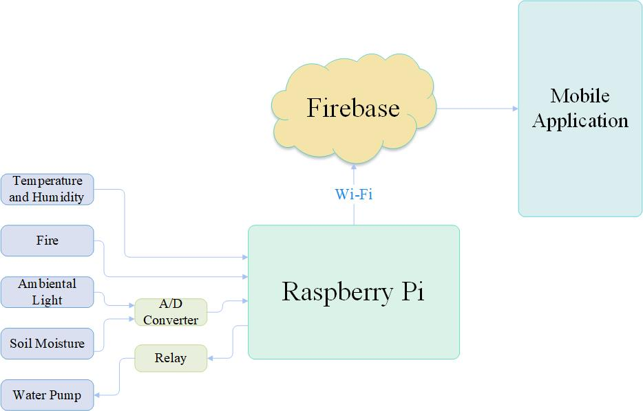
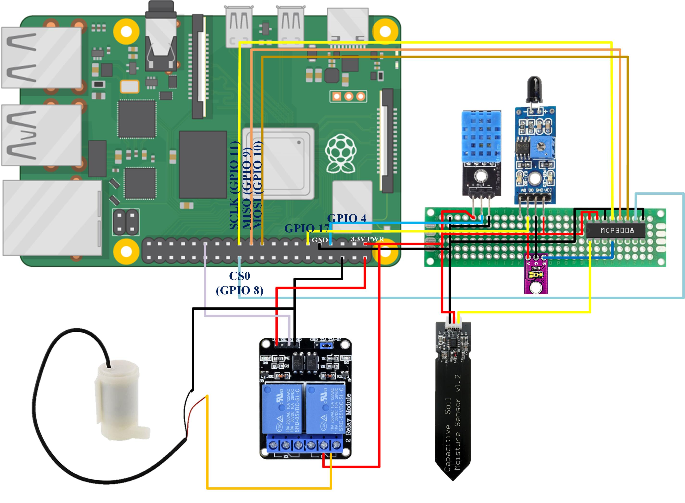
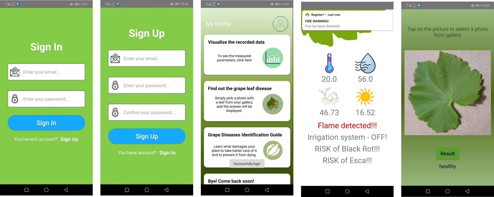

# Diploma_Project

The present project aims to implement a monitoring, control, display and alert system in a small vineyard. The block diagram of the entire system, from data collection to their visualization on the 
phone screen is illustrated below.

<figcaption align = "center"><b>System Architecture</b></figcaption>
 

The system for data collection consists of a Raspberry Pi Model 4 with Raspberry Pi OS and a set of environmental sensors connected to the board. 

The sensors used in the project are:
- temperature and humidity - DHT11
- soil moisture - capacitive soil moisture sensor
- light - TEMT6000
- fire - flame sensor module

<figcaption align = "center"><b>Hardware System</b></figcaption>
 

For the irrigation system is used a submersible water pump controlled by a relay. The pump activates only when the value measured by the capacitive soil sensor drops under a specific threshold. 

The application for data visualization is a practical implementation on Android platform and is the one that should reach the end user to handle it as a tool to facilitate decision making, or strategy planning. The data collected from sensors is firstly sent to the Firebase platform which is very useful for mobile applications and has many services. The sign in to Firebase is done using the Google account. Still, the current project uses only the authentication and real-time database. The parameters are displayed in the application after this connects to Firebase platform.

Below are some screenshots from the application.

<b>Android Application</b>

 
